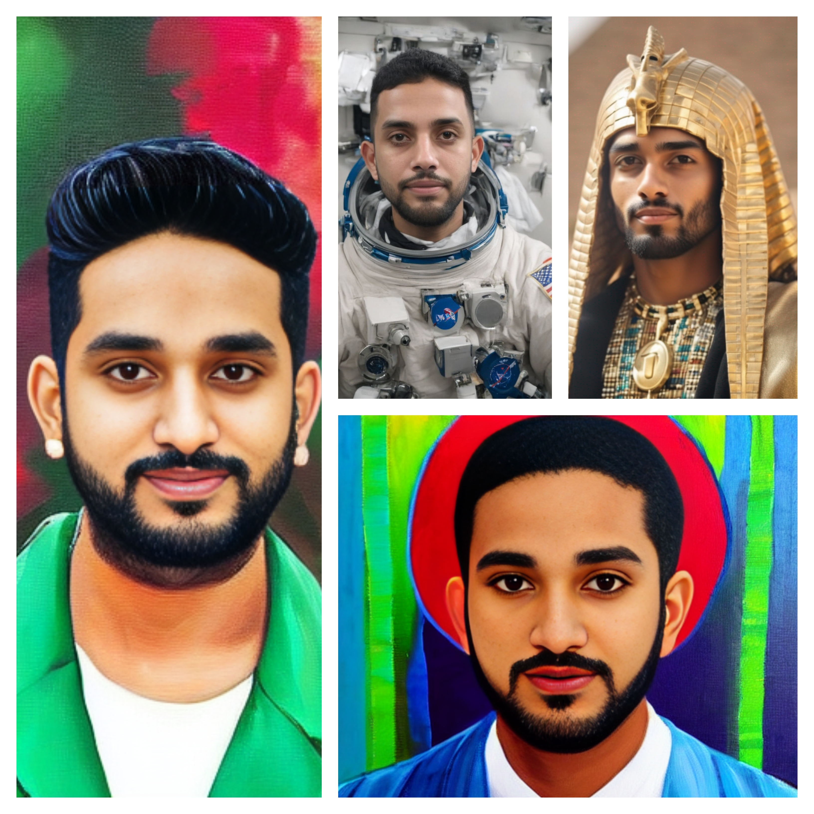
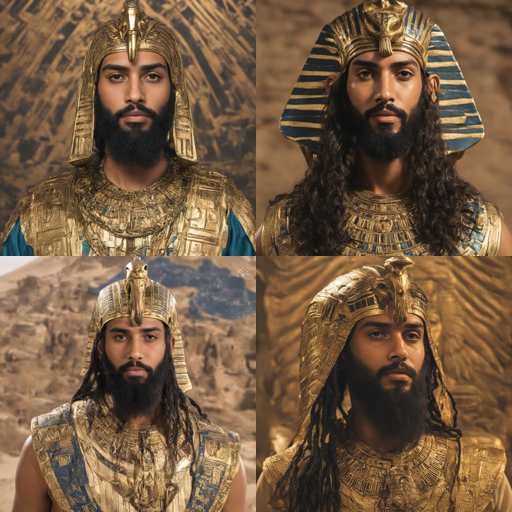
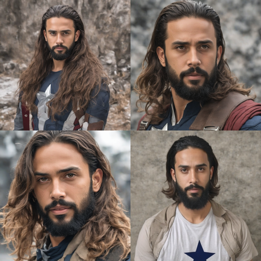

# stable-diffusion-finetuning

Stable Diffusion | PEFT | Dreambooth  | LoRA

## Setup

Clone this repo

```
git clone https://github.com/jkcg-learning/stable-diffusion-finetuning.git
cd stable-diffusion-finetuning
```

Install Dependencies

```
pip install -r requirements.txt
```

Configure Accelerate

```
accelerate config
```

My accelerate config looks like

```
compute_environment: LOCAL_MACHINE
debug: false
distributed_type: 'NO'
downcast_bf16: 'no'
gpu_ids: all
machine_rank: 0
main_training_function: main
mixed_precision: fp16
num_machines: 1
num_processes: 1
rdzv_backend: static
same_network: true
tpu_env: []
tpu_use_cluster: false
tpu_use_sudo: false
use_cpu: false
```


Tested with

```
tensorboard==2.16.2
tensorboardX==2.6.2.2
xformers==0.0.25
bitsandbytes==0.43.0
transformers==4.35.2
accelerate==0.24.1
compel==2.0.2
diffusers @ git+https://github.com/huggingface/diffusers.git@6bf1ca2c799f3f973251854ea3c379a26f216f36  
typer[all]==0.9.0
rich==12.5.1
```

## 😁 Outputs







## CLI Usage

```
❯ python main.py lora --help   
Usage: main.py [OPTIONS] COMMAND [ARGS]...                                                                                                        
 Fine Tune Stable Diffusion with LoRA                                                                                                              
                                                                                                                                                   
╭─ Options ───────────────────────────────────────────────────────────────────────────────────────────────────────────────────────────────────────╮
│ *  --input-images-dir                                     TEXT            Path to folder containing training data [default: None] [required]    │
│ *  --instance-prompt                                      TEXT            The prompt with identifier specifying the instance, e.g. 'a photo of  │
│                                                                           a jkcgprnna wearing casual clothes, smiling'                          │
│                                                                           [default: None]                                                       │
│                                                                           [required]                                                            │
│    --base-model                                           TEXT            Base Model to train StableDiffusion was trained on                    │
│                                                                           [default: stabilityai/stable-diffusion-xl-base-1.0]                   │
│    --pretrained-vae                                       TEXT            VAE model with better numerical stability                             │
│                                                                           [default: madebyollin/sdxl-vae-fp16-fix]                              │
│    --resolution                                           INTEGER         The resolution for input images, all the images will be resized to    │
│                                                                           this                                                                  │
│                                                                           [default: 1024]                                                       │
│    --train-batch-size                                     INTEGER         Batch Size (per device) for training [default: 1]                     │
│    --max-train-steps                                      INTEGER         Total number of training steps to run for, more your images, more     │
│                                                                           should be this value                                                  │
│                                                                           [default: 500]                                                        │
│    --gradient-accumulation-steps                          INTEGER         Number of update steps to accumulate before performing a backward     │
│                                                                           pass                                                                  │
│                                                                           [default: 1]                                                          │
│    --learning-rate                                        FLOAT           Initial learning rate for training, after warmup period               │
│                                                                           [default: 0.0001]                                                     │
│    --use-8bit-adam                  --no-use-8bit-adam                    Whether or not to use 8-bit Adam from bitsandbytes. Ignored if        │
│                                                                           optimizer is not set to AdamW                                         │
│                                                                           [default: no-use-8bit-adam]                                           │
│    --use-tf32                       --no-use-tf32                         Whether or not to allow TF32 on Ampere GPUs. Can be used to speed up  │
│                                                                           training.                                                             │
│                                                                           [default: no-use-tf32]                                                │
│    --mixed-precision                                      [no|fp16|bf16]  Whether to use mixed precision. Choose between fp16 and bf16          │
│                                                                           (bfloat16). Bf16 requires PyTorch >=1.10.and an Nvidia Ampere GPU.    │
│                                                                           Default to the value of accelerate config of the current system or    │
│                                                                           the flag passed with the `accelerate.launch` command. Use this        │
│                                                                           argument to override the accelerate config.                           │
│                                                                           [default: MixedPrecisionType.no]                                      │
│    --lora-rank                                            INTEGER         The dimension of the LoRA update matrices [default: 4]                │
│    --output-dir                                           TEXT            The output directory to store the logs, model predictions,            │
│                                                                           checkpoints and final lora model weights                              │
│                                                                           [default: lora-model]                                                 │
│    --help                                                                 Show this message and exit.                                           │
╰─────────────────────────────────────────────────────────────────────────────────────────────────────────────────────────────────────────────────╯

❯ python main.py infer --help

Inference with Trained LoRA                                                                                                                       
                                                                                                                                                   
╭─ Options ───────────────────────────────────────────────────────────────────────────────────────────────────────────────────────────────────────╮
│ *  --prompt                TEXT  The prompt for text to image, e.g. 'a photo of a jkcgprnna wearing casual clothes, smiling' [default: None]    │
│                                  [required]                                                                                                     │
│ *  --lora-weights          TEXT  Path to the lora safetensors, or the folder [default: None] [required]                                         │
│    --base-model            TEXT  Base Model your StableDiffusion was trained on [default: stabilityai/stable-diffusion-xl-base-1.0]             │
│    --pretrained-vae        TEXT  VAE model with better numerical stability [default: madebyollin/sdxl-vae-fp16-fix]                             │
│    --output-dir            TEXT  The output directory to store the images [default: infer-outputs]                                              │
│    --help                        Show this message and exit.                                                                                    │
╰─────────────────────────────────────────────────────────────────────────────────────────────────────────────────────────────────────────────────╯

```

## 🔥 Fine Tune

Create a folder inside dataset/train_data folder, and put your images, make sure the images are square crops, and the images should focus only on the subject, take different photos with different background and clothes for better results

Then start fine tuning!

I have used the instance prompt "jkcgprnna" to finetine SDXL on my own images

NOTE: It's comfortable to train on a 24GB VRAM Graphic Card, I have used A30 machine for this

```
accelerate launch main.py lora --input-images-dir ./dataset/train_images --instance-prompt "jkcgprnna" --resolution 512 --train-batch-size 1 --max-train-steps 1000 --mixed-precision fp16 --output-dir ./output/jkcgprnna_sdxl
```


## 🍺 Infer

```
python main.py infer --prompt "a photo of jkcgprnna in space, realistic, 8K, restore face" --lora-weights ./output/jkcgprnna_sdxl --output-dir output/images
```

## :airplane: Deploy

A webapp for inference is hosted on HuggingFace.

https://huggingface.co/spaces/jkcg/dreambooth-sdxl-jkcg

Note : The hosted model is finetuned on SD-1.5, using Dreambooth technique. The instance prompt used is "jkcgchry"